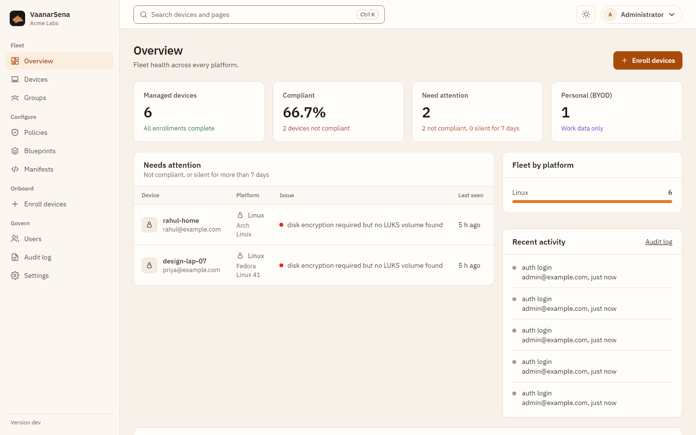
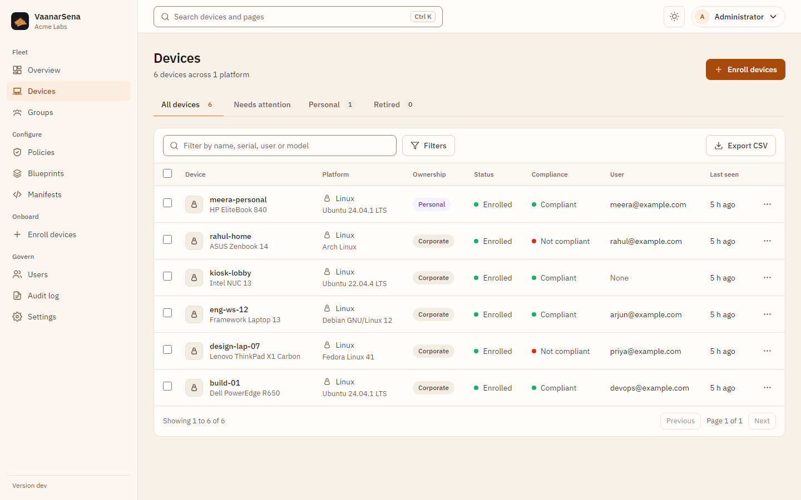
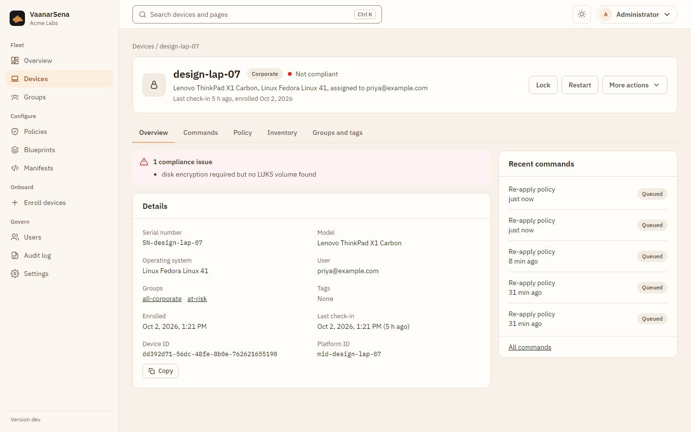
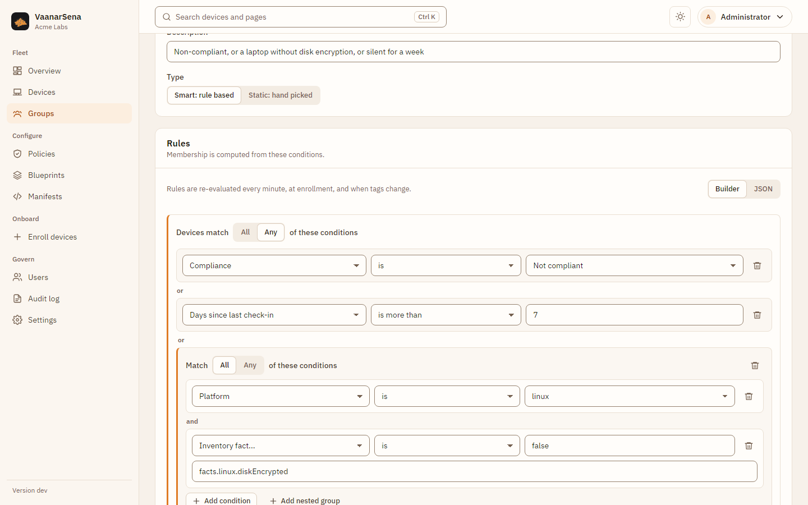
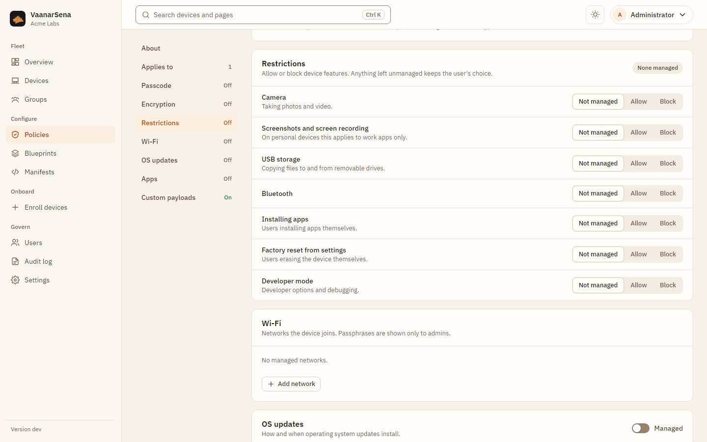
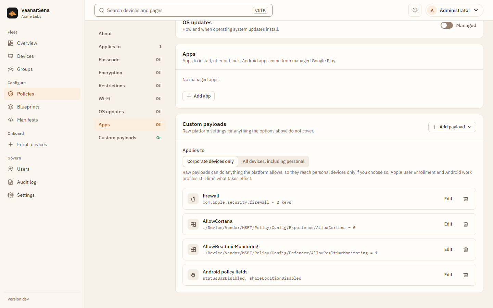
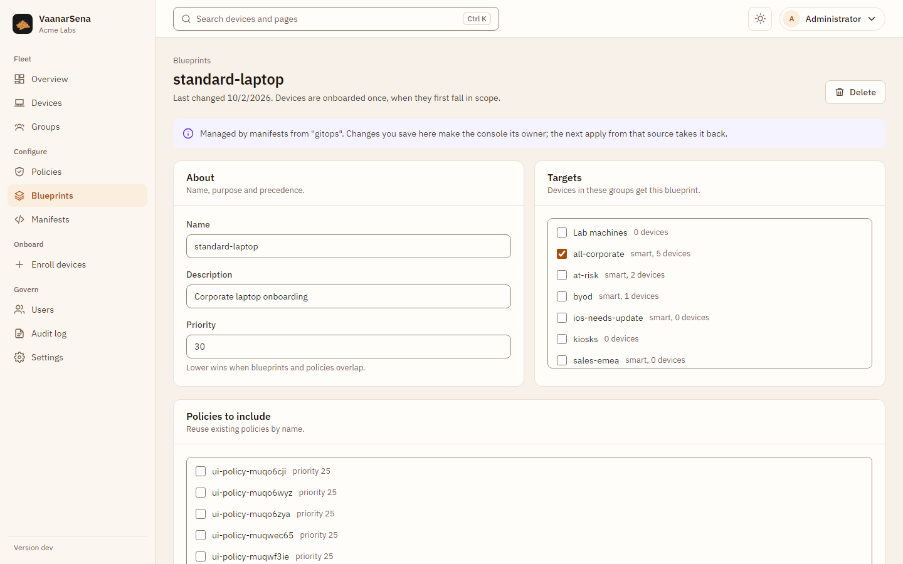
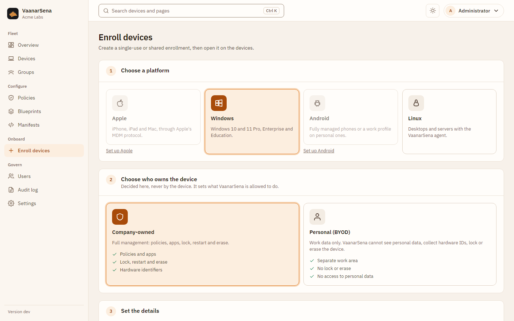
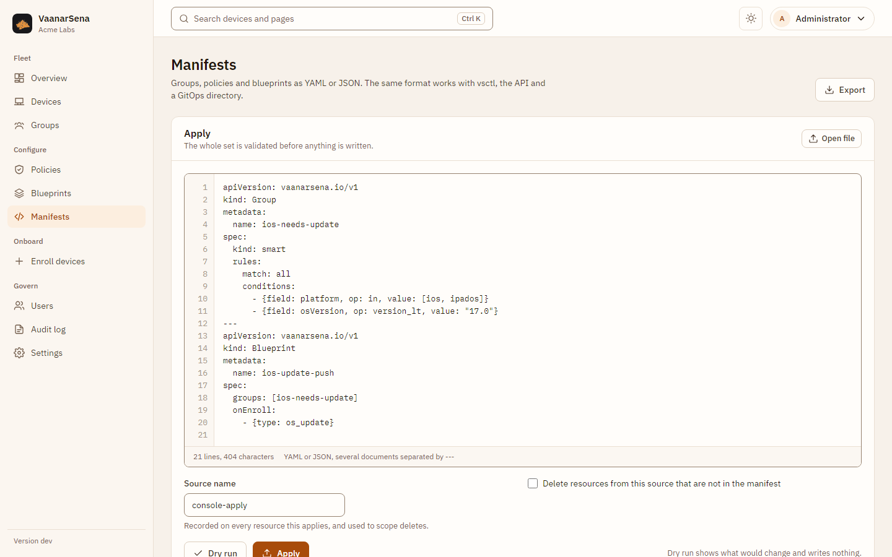
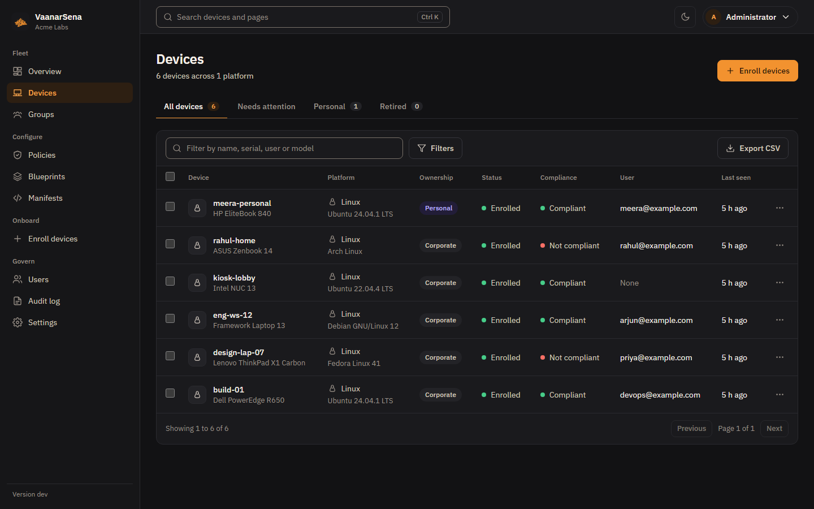

# The console

The web console is built into the server: there is nothing extra to install.
It works in light and dark themes and down to phone width. Everything it
does goes through the same [REST API](api.md) that `vsctl` and your own
automation use.

Press **Ctrl K** (Cmd K on a Mac) anywhere to jump to a page or find a device
by name, serial or user. The theme menu in the top bar switches between light,
dark and your system setting. Editors with unsaved changes ask before you
leave them, including with the browser's back button.

## Overview

How many devices are under management and how many need attention, by
platform, with the devices that are not compliant or have gone quiet, and
which platforms still need setup.

## Devices

Filter by platform, ownership, status or group, and search by name, serial,
user or model. Select several devices to send a command, add them to a static
group or tag them at once; only commands valid for every selected device are
offered.

The device page shows compliance issues, properties, command history, the
effective policy (the merge of everything that applies), the raw inventory and
its groups and tags. Commands have proper forms (a lock message, a macOS PIN,
an app ID, a script), and on personal devices only work-container commands
are offered.

## Groups

**Static groups** are curated by hand. **Smart groups** are defined by rules:
pick a field (platform, OS version, ownership, compliance, tags, days since
check-in, or any inventory fact), an operator and a value, and nest "all" or
"any" groups for complex conditions. **Preview matching devices** shows who the
rules match before you save. Membership updates every minute, at enrollment
and when tags change.

## Policies

One form for every platform: passcode, encryption, restrictions (each one not
managed, allowed or blocked), Wi-Fi, OS updates and apps. Lower priority
numbers win when several policies apply.

**Custom payloads** cover anything else: Apple payload dictionaries or an
uploaded `.mobileconfig`, Windows OMA-URI settings with their operation and
format, and raw Android Management API fields. They reach personal devices only
if you choose so.

Every editor has a JSON view of the same document, the format manifests and
the API use.

## Blueprints

Bundle existing policies, extra settings and onboarding steps (for example
install an app, run a script, update the OS) and target groups. Each device
runs the onboarding steps once, when it first falls in scope.

## Enroll devices

Pick the platform and the ownership, then optionally a user, a group, how many
devices may use the link and when it expires. The result is the link, QR code
or command to use on the device, shown once. Platforms that are not set up
link straight to their setup.

## Manifests

Paste or open YAML or JSON manifests, preview the changes with a dry run, and
apply. Export downloads everything as manifests to keep in Git. See
[Manifests](manifests.md).

## Settings

Connect Apple, Google, Android Enterprise and ChromeOS, and see the server's
version, public address and device certificate authority. See
[Platform setup](platforms.md).

## Govern

**Users** have one of three roles: auditors read, operators manage devices and
enrollment, admins do everything. The **audit log** records every change,
sign-in and refused command, and cannot be edited, even in the database.
**Account** is where you change your password and create API tokens for
automation.

