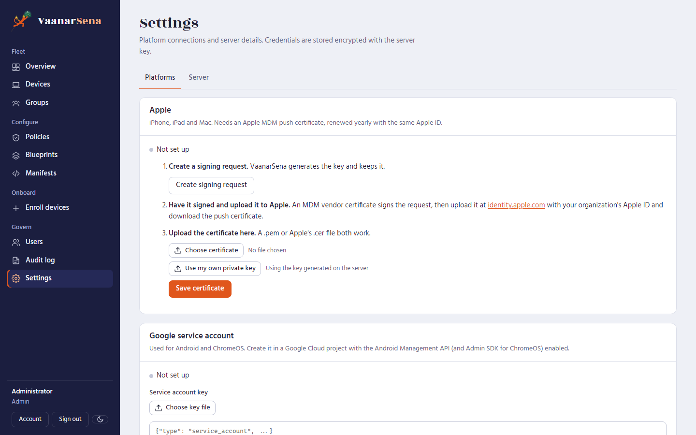

# Platform setup

Windows and Linux work out of the box. Apple, Android and ChromeOS need
credentials from Apple or Google, which you connect in the console under
**Settings > Platforms**. Credentials are stored encrypted with the server key
and take effect immediately, with no restart.



Every platform can also be configured with environment variables instead (see
[Configuration](configuration.md)). A platform configured that way shows
"Set by environment variables" in the console and cannot be changed there.

## Apple (iOS, iPadOS, macOS)

Apple devices are woken through Apple's push service (APNs), which needs an
**MDM push certificate** for your organization.

1. **Create a signing request.** In Settings > Platforms > Apple, choose
   **Create signing request** and download `vaanarsena-push.csr`. VaanarSena
   generates the private key and keeps it; it never leaves the server.
2. **Have it signed and upload it to Apple.** The request must be signed with
   an MDM vendor certificate (Apple Developer Enterprise Program, "MDM CSR"
   capability). Upload the signed request at
   [identity.apple.com](https://identity.apple.com) with your organization's
   Apple ID and download the push certificate.
3. **Upload the certificate.** Choose the `.pem` or Apple's `.cer` file and
   **Save certificate**. Apple enrollment is on as soon as it saves.

Already have a certificate and key from another tool? Use **Use my own private
key** in step 3 instead of generating a request.

The certificate lasts one year. **Renew it with the same Apple ID**: a new
certificate with a different push topic orphans every enrolled device. The
server logs a warning 30 days before it expires.

**Company-owned devices:** create an Apple, company-owned enrollment, open
the link in Safari on the device and install the profile from Settings.

**Personal devices (User Enrollment):** create an Apple, personal enrollment
with the user's **Managed Apple ID** (from Apple Business Manager) as the
user. iOS creates a separate managed volume; the organization cannot see
personal data, read hardware identifiers or erase the device, and the server
refuses those commands anyway.

Not yet supported: Automated Device Enrollment (ABM/DEP), Apps and Books (VPP)
licensing, Declarative Device Management. `install_app` works with an
enterprise app manifest URL.

## Windows 10 and 11

Built in; nothing to set up. Windows uses the on-premises enrollment flow:
the user's email plus the enrollment token as the password.

1. In **Enroll devices**, choose Windows, enter the user's email and create the
   enrollment.
2. On the PC: **Settings > Accounts > Access work or school > Enroll only in
   device management**, or open the `ms-device-enrollment:` link from the
   console.
3. Enter the email and the server address shown, then the token when asked
   for a password.

Home editions of Windows have no MDM client; use Pro, Enterprise or Education.

For enrollment by email address alone, publish
`enterpriseenrollment.<your-email-domain>` as a CNAME to the server.

Windows checks in every 15 minutes and at sign-in. Push wake-ups need
Microsoft's WNS and are not used.

The management endpoint authenticates the PC by TLS client certificate.
Behind a proxy, the proxy must request the client certificate and pass it on;
see [Hosting](hosting.md).

Personal PCs receive only sign-in (`DeviceLock`) policies. BitLocker, camera,
USB and update policies are company-owned only.

## Android

Uses Google's **Android Management API**. You need a Google Cloud project with
a service account, then an Android Enterprise bound to it.

### 1. Create the service account

1. In the [Google Cloud console](https://console.cloud.google.com), create or
   pick a project and enable the **Android Management API**.
2. Under **IAM & Admin > Service accounts**, create a service account and
   grant it the **Android Management User** role.
3. On the service account, **Keys > Add key > JSON**, and download the file.
4. In VaanarSena, **Settings > Platforms > Google service account**: choose the
   key file (the project ID is read from it) and **Save key**.

### 2. Connect the Android Enterprise

In **Settings > Platforms > Android**, choose **Connect Android Enterprise**.

You are sent to Google's sign-up, where you name the enterprise and accept the
terms with a Google account. Google then sends you back to VaanarSena, which
creates the enterprise and turns Android management on. The page shows
"Android Enterprise connected".

That return trip is authenticated by a single-use link that expires after an
hour, so the sign-up must be finished in one go. If it fails or times out,
choose Connect again.

Already have an enterprise (for example from an earlier installation)? Enter
its name, `enterprises/LC0...`, under **Already have an enterprise?** instead.

### 3. Enroll devices

**Company-owned (fully managed):** create an Android, company-owned
enrollment. On a factory-reset device, tap the welcome screen six times and
scan the QR code from the console.

**Personal (work profile):** create an Android, personal enrollment and open
the enrollment link on the phone. Android isolates the work profile;
**Retire** deletes it and leaves personal data alone.

Devices sync every 5 minutes. Apps are managed through the policy **Apps**
section (platform Android), and raw Android Management API fields can be added
under **Custom payloads**.

## ChromeOS

ChromeOS devices are enrolled into your Google Workspace or Chrome Enterprise
domain on the device itself. VaanarSena imports them and sends commands.

1. Add the Google service account (see Android, step 1) and enable the
   **Admin SDK API** in the same project.
2. In the [Google Admin console](https://admin.google.com), **Security > API
   controls > Domain-wide delegation**, add the service account's client ID
   with the scope `https://www.googleapis.com/auth/admin.directory.device.chromeos`.
3. In **Settings > Platforms > ChromeOS**, enter a Workspace admin the service
   account may act as, and **Connect ChromeOS**.

Chromebooks sync every 15 minutes. Supported commands: refresh, restart, lock
(disable), erase (remote powerwash) and retire (deprovision). Device policy
stays in the Google Admin console.

## Linux

Built in. The agent supports systemd-based distributions with apt, dnf, zypper
or pacman, on amd64 and arm64. Download it from the
[releases page](https://github.com/dmdhrumilmistry/VaanarSena/releases/latest).

```bash
sudo install -m 0755 vaanarsena-agent-linux-amd64 /usr/local/bin/vaanarsena-agent
sudo vaanarsena-agent enroll --server https://mdm.example.com --token <TOKEN>
# With a private TLS CA:  --server-ca /path/to/ca.pem
sudo curl -fsSLo /etc/systemd/system/vaanarsena-agent.service \
  https://github.com/dmdhrumilmistry/VaanarSena/releases/latest/download/vaanarsena-agent.service
sudo systemctl enable --now vaanarsena-agent
```

The agent checks in every 60 seconds over mutual TLS. Company-owned machines
support lock, restart, shutdown, OS update, package install and remove, and
running scripts (admins only; the full script is written to the audit log).
It blocks USB storage when a policy asks and reports disk encryption (LUKS)
compliance.

Personal machines run in **inventory-only** mode: the agent sends basic facts
(no serial numbers or hardware identifiers), evaluates compliance, enforces
nothing, and refuses every command except refresh and retire, even if the
server were to send one.
